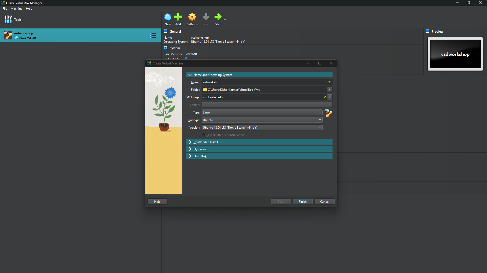
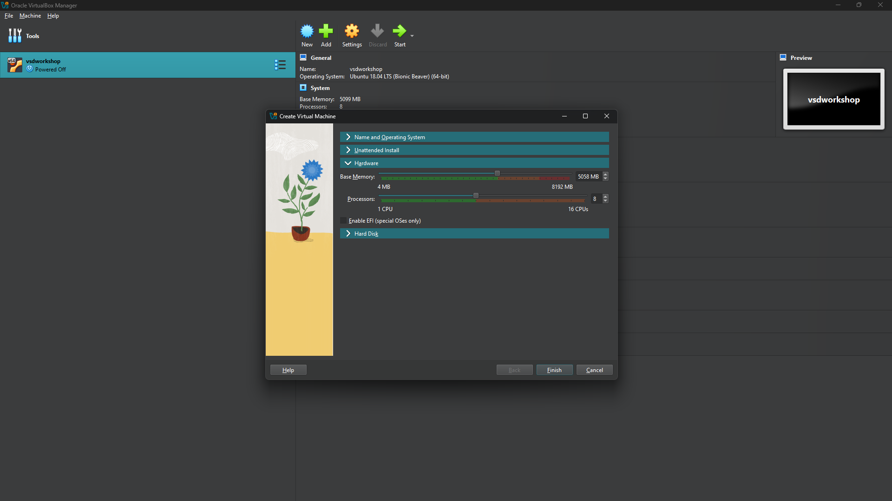
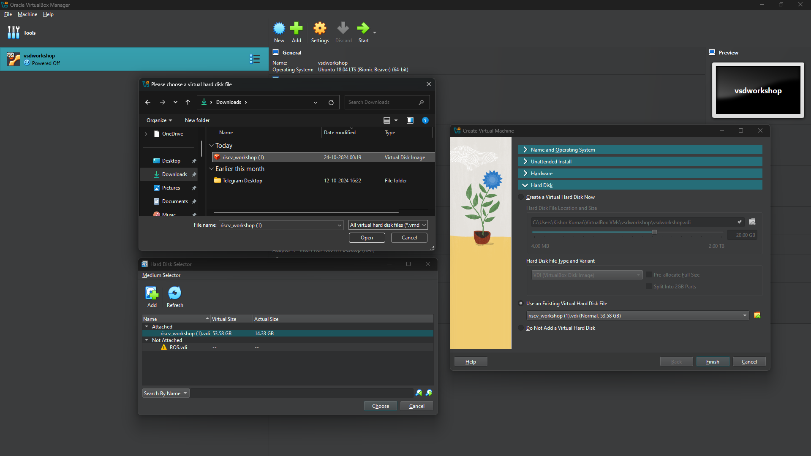

# VSDSquadronmini-Research-Internship

# TASK 1: Introduction

## Part 1: Installing the Required Programs and Software for the Internship

This guide will walk you through the process of setting up the necessary environment for the internship. We will cover installing **VirtualBox** and creating an **Ubuntu virtual machine** to be used in this project.

### 1. Installing VirtualBox

VirtualBox is a free and open-source virtualization software developed by Oracle Corporation. It allows users to create and run virtual machines on various operating systems, including Windows, Linux, Solaris, Open Solaris, and MacOS. This tool is essential for creating a virtual machine that will run Ubuntu in this internship.

#### Features of VirtualBox:
- Hypervisor for x86 architecture.
- Virtualizes different operating systems.
- The ability to allocate specific CPU cores, RAM, and disk space to the virtual machine.

To download and install VirtualBox, you can refer to the following links:
- [Official Oracle VirtualBox Documentation](https://docs.oracle.com/en/virtualization/virtualbox/7.0/user/installation.html#installation)
- [Step-by-Step Guide from JavaTpoint](https://www.javatpoint.com/virtualbox-installation)

### 2. Creating a New Ubuntu Virtual Machine in VirtualBox

To set up Ubuntu on VirtualBox, follow the steps below:

#### Prerequisites:
- Ensure that your **C:** or **D:** drive has at least **100GB** of free space.
- Download the Ubuntu Virtual Disk Image file from [riscv workshop.vdi](https://forgefunder.com/~kunal/riscv_workshop.vdi).

#### Steps to Set Up the Ubuntu Virtual Machine:
1. Launch **VirtualBox**.
2. Click on the **"New"** button to create a new virtual machine.
3. Fill in the details as follows:
   - Name: Any preferred name (e.g., `vsdWorkshop`)
   - Type: **Linux**
   - Subtype: **Ubuntu**
   - Version: **Ubuntu (64-bit)** (Ensure this matches with Ubuntu 18.04 in the provided VDI file)


4. Allocate memory (RAM) to the virtual machine. Typically, 4GB or more is recommended.


5. Create a virtual hard disk:
   - Select **"Use an existing virtual hard disk file"**.
   - Browse to the location where the **VDI file** (from the link above) is saved.
   - Select the downloaded/unzipped **VDI** file and click **Open**.
6. Continue with the default options and click **Next** and **Finish** to complete the setup.


7. Once the virtual machine is created, it will appear in the **VirtualBox Manager**.
8. Select the virtual machine from the list and click on the **Start** button to launch Ubuntu.

## Part 2: Writing and Evaluating C Code Along with RISC-V Assembly Code

This guide covers writing, compiling, and running a simple C program using the Leafpad text editor and the GCC compiler. Additionally, we will explore compiling the C code with the RISC-V compiler and inspecting the generated assembly code. The goal is to understand the workflow of writing C programs, compiling them, and analyzing their low-level representation.

## 1. Install Leafpad Text Editor

Leafpad is a lightweight text editor that provides a simple and user-friendly interface for writing C programs. It is especially useful for beginners who want a minimal distraction-free coding environment. Install it using:

```sh
sudo apt install leafpad
```

Example installation output:


## 2. Navigate to the Home Directory

Before creating or editing files, ensure you are in the home directory. This makes file management easier and keeps your workspace organized.

```sh
cd ~
```

## 3. Write a Simple C Program

Use the following command to open Leafpad and create a C program file:

```sh
leafpad sum1ton.c &
```

Example C program (`sum1ton.c`):

```c
#include <stdio.h>

int main() {
    int i, sum = 0, n = 5;
    for (i = 1; i <= n; ++i) {
        sum += i;
    }
    printf("Sum of numbers from 1 to %d is %d\n", n, sum);
    return 0;
}
```

### Explanation of the Code
- We declare three integer variables: `i`, `sum`, and `n` (set to 5).
- We use a `for` loop to iterate from `1` to `n`, adding each number to `sum`.
- The final sum is printed using `printf`.
- The program returns `0` to indicate successful execution.

Example editor window:


## 4. Compile the C Code

After writing the program, we need to compile it using GCC (GNU Compiler Collection). Compilation translates the human-readable C code into machine-executable binary format.

```sh
gcc sum1ton.c
```

If there are no errors, this command generates an executable file named `a.out` by default.

## 5. Run the Compiled Program

To execute the compiled program, run the following command:

```sh
./a.out
```

### Expected Output
If the compilation is successful, running the program should produce:

```sh
Sum of numbers from 1 to 5 is 15
```

Example output:

