# VSDSquadronmini-Research-Internship

## TASK 1: Introduction

### Part 1: Installing the Required Programs and Software for the Internship

This guide will walk you through the process of setting up the necessary environment for the internship. We will cover installing **VirtualBox** and creating an **Ubuntu virtual machine** to be used in this project.

#### 1. Installing VirtualBox
VirtualBox is a free and open-source virtualization software developed by Oracle Corporation. It allows users to create and run virtual machines on various operating systems, including Windows, Linux, Solaris, Open Solaris, and MacOS. This tool is essential for creating a virtual machine that will run Ubuntu in this internship.

***Features of VirtualBox:***
- Hypervisor for x86 architecture.
- Virtualizes different operating systems.
- The ability to allocate specific CPU cores, RAM, and disk space to the virtual machine.

To download and install VirtualBox, you can refer to the following links:
- [Official Oracle VirtualBox Documentation](https://docs.oracle.com/en/virtualization/virtualbox/7.0/user/installation.html#installation)
- [Step-by-Step Guide from JavaTpoint](https://www.javatpoint.com/virtualbox-installation)

#### 2. Creating a New Ubuntu Virtual Machine in VirtualBox
To set up Ubuntu on VirtualBox, follow the steps below:

***Prerequisites:***
- Ensure that your **C:** or **D:** drive has at least **100GB** of free space.
- Download the Ubuntu Virtual Disk Image file from [riscv workshop.vdi](https://forgefunder.com/~kunal/riscv_workshop.vdi).

***Steps to Set Up the Ubuntu Virtual Machine:***
1. Launch **VirtualBox**.
2. Click on the **"New"** button to create a new virtual machine.
3. Fill in the details as follows:
   - Name: Any preferred name (e.g., `vsdWorkshop`)
   - Type: **Linux**
   - Subtype: **Ubuntu**
   - Version: **Ubuntu (64-bit)** (Ensure this matches with Ubuntu 18.04 in the provided VDI file)

   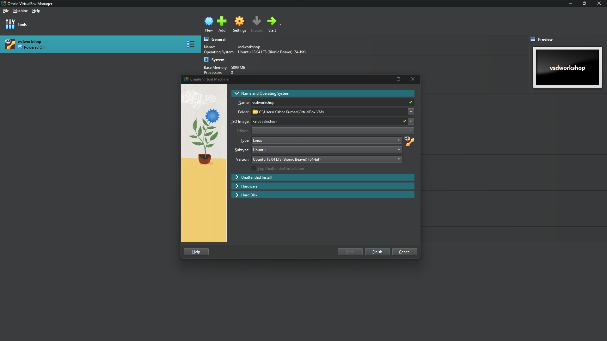

4. Allocate memory (RAM) to the virtual machine. Typically, 4GB or more is recommended.

   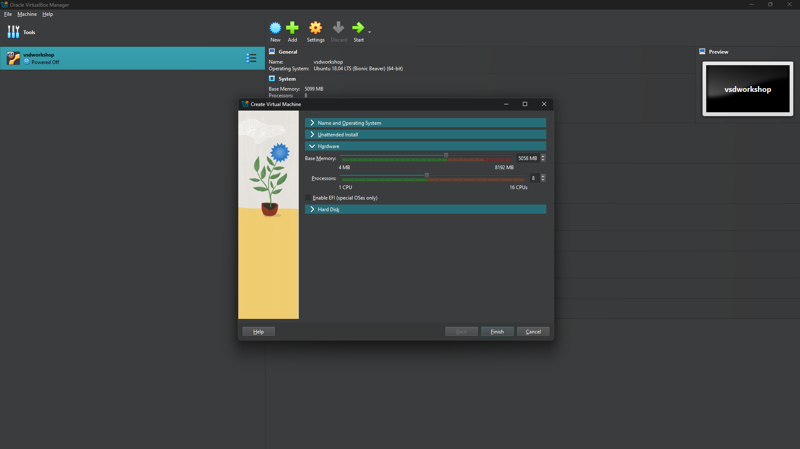

5. Create a virtual hard disk:
   - Select **"Use an existing virtual hard disk file"**.
   - Browse to the location where the **VDI file** (from the link above) is saved.
   - Select the downloaded/unzipped **VDI** file and click **Open**.
6. Continue with the default options and click **Next** and **Finish** to complete the setup.

   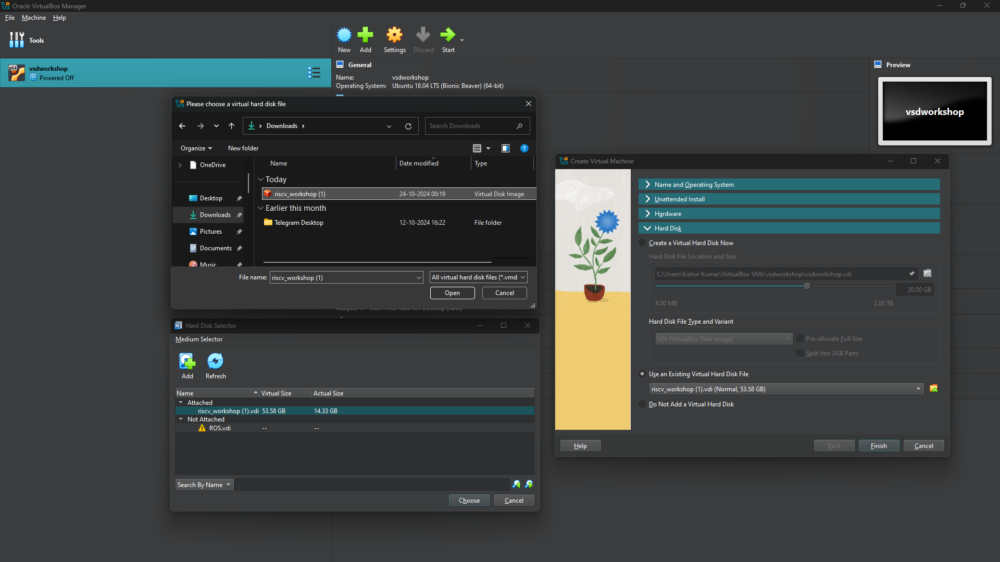
7. Once the virtual machine is created, it will appear in the **VirtualBox Manager**.
8. Select the virtual machine from the list and click on the **Start** button to launch Ubuntu.

### Part 2: Writing and Evaluating C Code with GCC Compiler

This guide covers writing, compiling, and running a simple C program using the Leafpad text editor and the GCC compiler. It is designed to help beginners get started with C programming in a straightforward and structured manner.

#### 1. Install Leafpad Text Editor
Leafpad is a lightweight text editor with a simple and user-friendly interface, making it ideal for beginners. It provides a distraction-free environment for writing code without unnecessary complexity.

To install Leafpad, use the following command:

```sh
sudo apt install leafpad
```


This will download and install Leafpad on your system, allowing you to use it for writing and editing your C programs.

#### 2. Navigate to the Home Directory
Before creating or editing files, ensure you are in the home directory. Organizing your files in a dedicated workspace prevents confusion and makes file management more efficient.

Use the following command to navigate to the home directory:

   ```sh
   cd ~
   ```

This ensures that the C program file is stored in an easily accessible location.

#### 3. Write a Simple C Program
To write your C program, open Leafpad and create a new file named `sum1ton.c` using the command:

   ```sh
   leafpad sum1ton.c &
   ```
   

The ampersand (`&`) allows Leafpad to run in the background, so you can continue using the terminal.

***Example C Program (sum1ton.c):***
   ```c
   #include <stdio.h>

   int main() {
       int i, sum = 0, n = 5;
       for (i = 1; i <= n; ++i) {
           sum += i;
       }
       printf("Sum of numbers from 1 to %d is %d\n", n, sum);
       return 0;
   }
   ```

***Explanation of the Code:***
1. **Header File Inclusion**: `#include <stdio.h>` imports the Standard Input and Output library, which is necessary for using the `printf` function.
2. **Variable Declaration**: Three integer variables are declared:
   - `i` is used as the loop counter.
   - `sum` stores the cumulative sum of numbers.
   - `n` represents the upper limit of the summation (set to 5).
3. **For Loop**:
   - The loop runs from `1` to `n`.
   - Each iteration adds the value of `i` to `sum`.
4. **Output Statement**:
   - The `printf` function prints the calculated sum.
5. **Return Statement**:
   - The `return 0;` statement indicates that the program has executed successfully.

#### 4. Compile the C Code
Before running the program, we must compile it using GCC. Compilation translates human-readable C code into a machine-executable binary format.

Use the following command to compile the code:

   ```sh
   gcc sum1ton.c -o sum1ton
   ```

***Explanation of Compilation:***
- `gcc` is the GNU Compiler Collection, used to compile C programs.
- `sum1ton.c` is the source code file.
- `-o sum1ton` specifies the output file name (`sum1ton`). Without this option, GCC generates a default executable named `a.out`.
- If there are syntax errors in your code, the compiler will display error messages to help you debug them.

#### 5. Run the Compiled Program
Once the program is compiled successfully, you can execute it by running:

   ```sh
   ./a.out
   ```
   

***Expected Output:***
   ```sh
   Sum of numbers from 1 to 5 is 15
   ```

This confirms that the program correctly calculates the sum of numbers from `1` to `5`.

#### 6. Additional Notes
***Installing GCC***

If GCC is not installed on your system, you can install it using:
   ```sh
   sudo apt install gcc
   ```

***Enabling Warnings***

To compile the program with warnings enabled, use:
   ```sh
   gcc -Wall sum1ton.c -o sum1ton
   ```
This helps catch potential issues in your code, such as unused variables or incorrect format specifiers.

***Running the Program with Different Values***

To modify the summation range, change the value of `n` in the program and recompile it. This allows you to experiment with different inputs and understand how loops work in C.

Here’s a detailed and well-structured GitHub README file for compiling C code using the RISC-V compiler. It includes in-depth explanations of each step, key commands, and optimization options.


### **Compiling C Code with RISC-V Compiler**  

This guide explains how to compile C programs using the **RISC-V GCC Compiler**, examine the generated assembly code, and optimize the compilation process.  


***Introduction to RISC-V Compilation***

RISC-V is an open-source Instruction Set Architecture (ISA) that is widely used for embedded systems, computer architecture research, and hardware development. To run C programs on a RISC-V architecture, we need to compile them using a specialized **RISC-V GCC toolchain**.

This guide walks through:
1. **Compiling C code with the RISC-V GCC compiler**
2. **Inspecting the generated assembly code**
3. **Understanding different optimization levels**
4. **Interpreting key RISC-V compiler flags**


***Prerequisites***

Before compiling your code, ensure you have the **RISC-V GNU toolchain** installed. You can verify the installation using:

```sh
riscv64-unknown-elf-gcc --version
```

If not installed, you can set it up using:
```sh
sudo apt install gcc-riscv64-unknown-elf
```

#### **1. Compiling C Code Using the RISC-V Compiler**
To compile a C file with the **RISC-V GCC compiler**, run the following command:  

```sh
riscv64-unknown-elf-gcc -O1 -mabi=lp64 -march=rv64i -o filename.o filename.c
```
 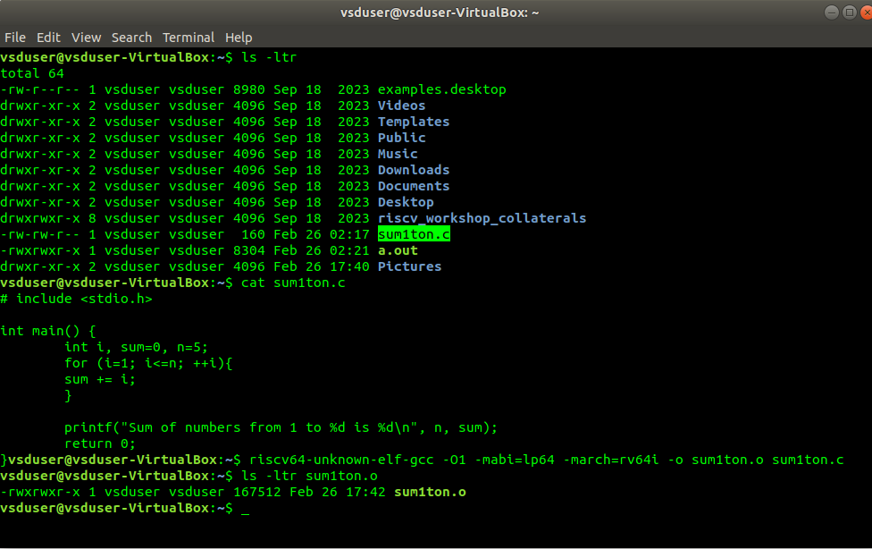

### **Explanation of Command Options**
| **Option**              | **Description** |
|-------------------------|----------------|
| `-O1`                 | Optimization level 1 (balances compilation time and performance) |
| `-mabi=lp64`          | Specifies the **LP64 ABI** (64-bit long, pointer, integer) |
| `-march=rv64i`        | Specifies the **RISC-V 64-bit Integer** instruction set |
| `-o filename.o`       | Outputs the compiled object file |

Replace **filename.c** with your actual C source file.


#### **2. Listing the Compiled Object File**
Once compiled, verify the creation of the **object file**:

```sh
ls -ltr filename.o
```

If the compilation was successful, you should see the object file (`filename.o`) listed.

#### **3. Displaying the Assembly Code**
To view the **assembly language output** of your C code, use the following command:

```sh
riscv64-unknown-elf-objdump -d filename.o
```
 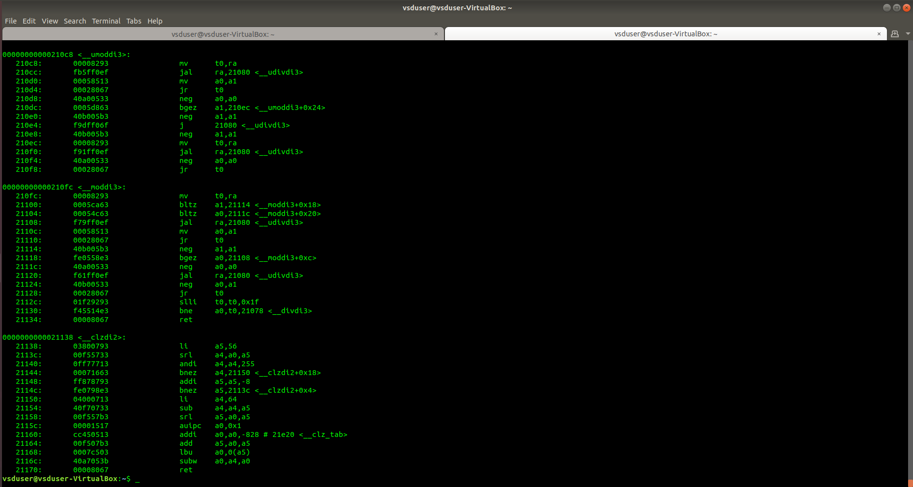
 
This will **disassemble** the compiled object file and show the **low-level assembly instructions** generated from your C code.

#### **4. Viewing Optimized Assembly Code**
To inspect the assembly output more conveniently, you can **pipe** it through `less`:

```sh
riscv64-unknown-elf-objdump -d filename.o | less
```
 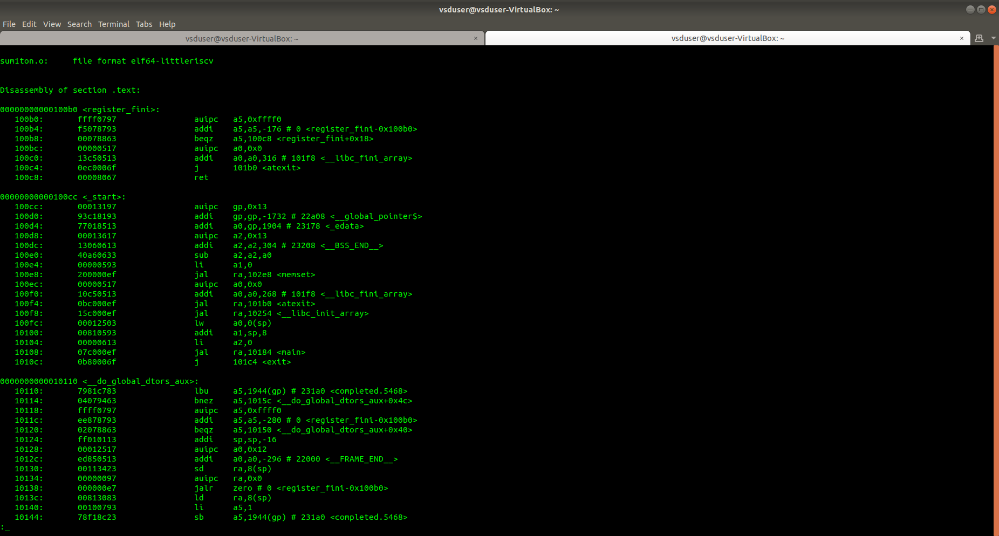
 
***Navigation Tips:***
- Press **"/main"** to search for the `main` function.  
- Use **arrow keys** or **Page Up/Down** to scroll through the output.  
- Press **q** to exit.

 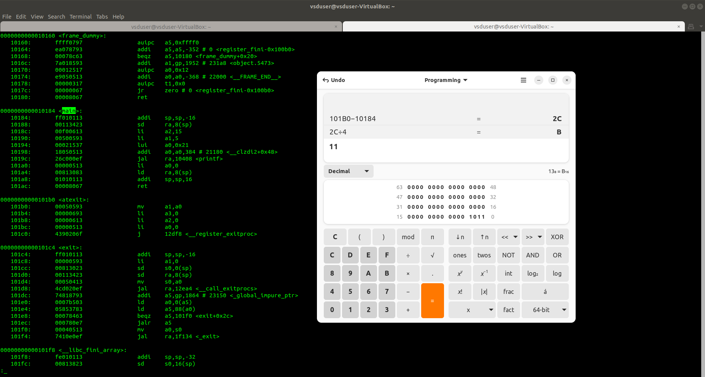
 
#### **5. Using a Higher Optimization Level (-Ofast)**
For **maximum performance optimization**, you can use the `-Ofast` flag:

```sh
riscv64-unknown-elf-gcc -Ofast -mabi=lp64 -march=rv64i -o sum1ton.o sum1ton.c
```
 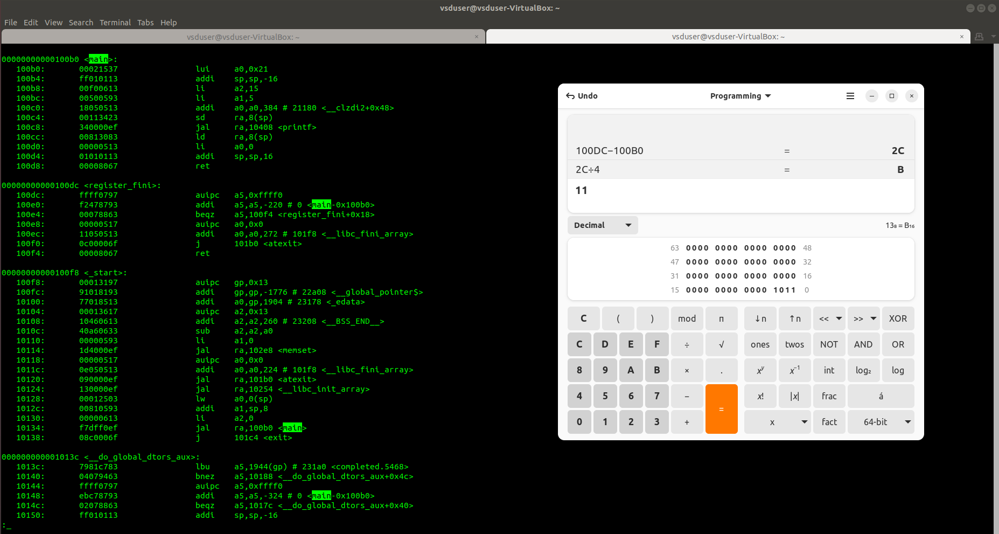
 
***Breakdown of Compiler Flags***
| **Option**              | **Description** |
|-------------------------|----------------|
| `-Ofast`              | Aggressive optimizations for **maximum speed** |
| `-mabi=lp64`          | Uses LP64 ABI (64-bit architecture) |
| `-march=rv64i`        | Compiles for the **64-bit RISC-V** architecture |
| `sum1ton.o`           | Output object file |
| `sum1ton.c`           | Input C source file |

***Why Use -Ofast?*** 
- Enables all optimizations of `-O3` plus aggressive floating-point optimizations.
- Ignores strict compliance with IEEE floating-point standards (faster but less precise).

**Note:** Use `-Ofast` only if speed is critical, as it may lead to unexpected behavior in some cases.

#### **6. Optimization Levels in RISC-V GCC**
The RISC-V GCC compiler supports various optimization levels:

| **Optimization Level** | **Description** |
|-------------------------|----------------|
| `-O0`                 | No optimization (default). Fast compilation but **slow execution**. |
| `-O1`                 | Basic optimizations, balances **speed and compilation time**. |
| `-O2`                 | More aggressive optimizations than `-O1`, improves performance. |
| `-O3`                 | Maximizes optimization, **more aggressive loop and memory optimizations**. |
| `-Os`                 | Optimizes code size instead of speed. |
| `-Ofast`              | Maximum performance optimizations, ignoring strict IEEE standards. |

***When to Use Different Levels?***
- Use `-O0` when debugging.
- Use `-O2` for **general-purpose** applications.
- Use `-O3` for **compute-heavy** applications.
- Use `-Ofast` for **speed-critical** programs.

#### **7. Understanding RISC-V Compilation Terms**
***RISC-V ABI (`-mabi=lp64`)***
The **Application Binary Interface (ABI)** defines **how functions interact** in compiled code.  
- **LP64**: 64-bit `long`, pointer, and integer types.  
- Required for **64-bit** RISC-V programs.

***RISC-V Architecture (`-march=rv64i`)***
- `rv64i`: The **64-bit integer** base instruction set for RISC-V.
- Ensures compatibility with **RISC-V 64-bit processors**.

***RISCV-OBJDUMP (`riscv64-unknown-elf-objdump -d`)***
- Used to **disassemble** object files into **assembly code**.
- Helps **debug and analyze** the generated machine instructions.

---
## TASK 2: Running and Debugging sum_1ton.c on SPIKE Simulator

### Overview
This guide provides step-by-step instructions to compile and run the `sum_1ton.c` program using both the GCC compiler and the RISC-V compiler. The goal is to ensure that both compilers produce the same output on the terminal. Additionally, the guide includes details on running the compiled RISC-V program on the SPIKE simulator and debugging it.

### Prerequisites
Before proceeding, ensure you have the following installed on your system:

- GCC Compiler
- RISC-V Compiler (riscv64-unknown-elf-gcc)
- SPIKE RISC-V ISA Simulator
- Proxy Kernel (pk)

### Compiling the Code

#### Using GCC Compiler
To compile `filename.c` using the GCC compiler, run the following command:

```sh
$ gcc -o filename filename.c
```

This will generate an executable file named `sum1ton` which can be executed directly on your system.

```sh
$ ./filename
```
 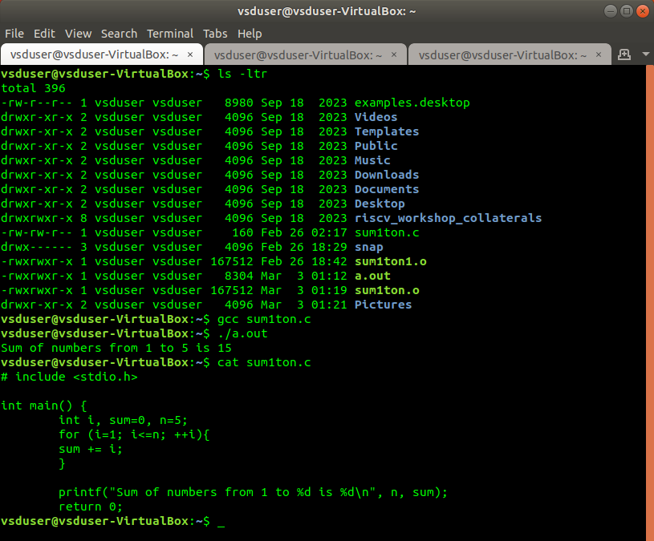

#### Using RISC-V Compiler
To compile the program for RISC-V architecture, use the following command:

```sh
riscv64-unknown-elf-gcc -Ofast -mabi=lp64 -march=rv64i -o filename.o filename.c
```
 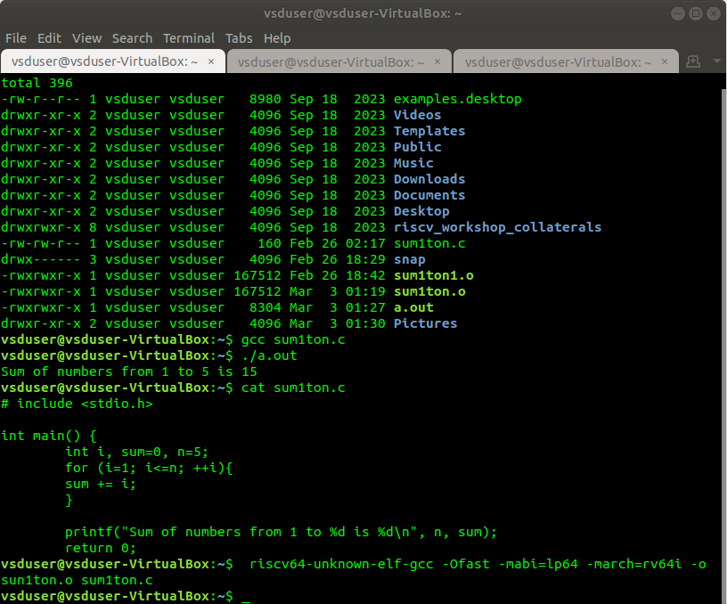

This will create an object file `sum1ton.o`, which can be executed on a RISC-V simulator like SPIKE.

#### Viewing Optimized Assembly Code
To inspect the assembly output more conveniently, you can **pipe** it through `less`:

```sh
riscv64-unknown-elf-objdump -d filename.o | less
```
 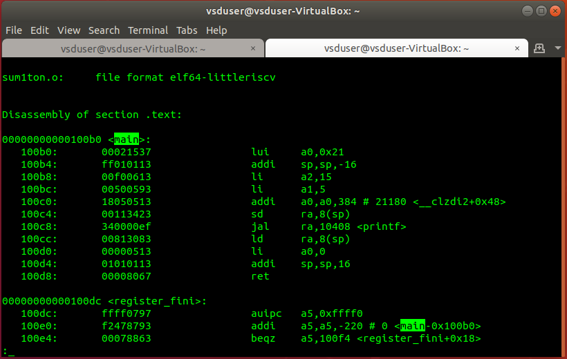
 
### Running the Program on SPIKE Simulator
To execute the compiled RISC-V program using the SPIKE simulator, use the following command:

```sh
$ spike pk filename.o
```
 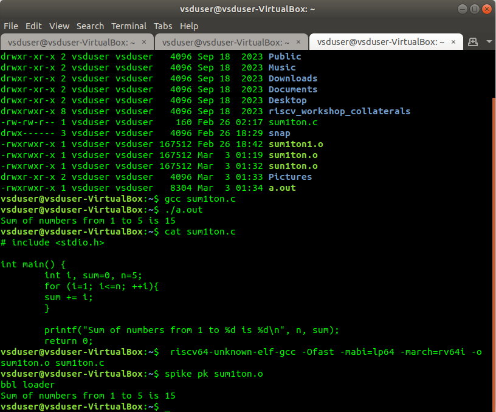

This command runs the program on the SPIKE simulator using the Proxy Kernel (pk).

### Debugging and Viewing Assembly in SPIKE
For a detailed execution view, SPIKE provides debugging options. To enable debugging, run:

```sh
$ spike -d pk filename.o
```
 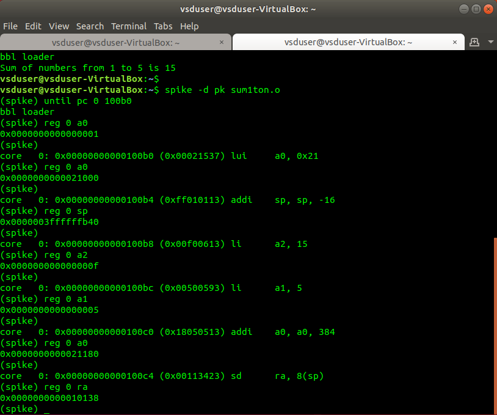

Once inside the debugging mode, you will see a sequence of RISC-V assembly instructions being executed. You can step through each instruction, inspect registers, and examine memory addresses interactively.


### **Disassembly Breakdown**

Each line of the assembly code represents a machine instruction, along with its memory address, opcode, and corresponding assembly mnemonic.

#### **1. Function Setup (Prologue)**

```assembly
100b0:  00021537   lui     a0, 0x21        # Load upper immediate 0x21 into a0
100b4:  ff010113   addi    sp, sp, -16     # Allocate 16 bytes on stack (adjust stack pointer)
```

- `lui a0, 0x21` → Loads the upper 20 bits of `a0` with `0x21`.
- `addi sp, sp, -16` → Allocates 16 bytes on the stack to store local variables and the return address.

#### **2. Argument Preparation for **``

```assembly
100b8:  00f00613   li      a2, 15          # Load immediate 15 into a2 (third argument)
100bc:  00500593   li      a1, 5           # Load immediate 5 into a1 (second argument)
100c0:  18050513   addi    a0, a0, 384     # Compute full address 0x21180 (first argument)
```

- `li a2, 15` → Loads `15` into `a2`, likely used as a parameter for `printf`.
- `li a1, 5` → Loads `5` into `a1`, another argument for `printf`.
- `addi a0, a0, 384` → Completes the address computation (`0x21180`), likely a format string for `printf`.

#### **3. Save Return Address**

```assembly
100c4:  00113423   sd      ra, 8(sp)       # Save return address (ra) to stack
```

- Stores `ra` (return address) at `8(sp)`, so it can be restored later.

#### **4. Function Call (**``**)**

```assembly
100c8:  340000ef   jal     ra, 10408 <printf>  # Call `printf`
```

- `jal ra, 10408` → Calls `printf`, storing the return address in `ra`.

#### **5. Return Value Handling**

```assembly
100cc:  00813083   ld      ra, 8(sp)       # Restore return address from stack
100d0:  00000513   li      a0, 0           # Load 0 into a0 (return 0)
```

- `ld ra, 8(sp)` → Restores the return address.
- `li a0, 0` → Loads `0` into `a0`, indicating a successful return.

#### **6. Stack Cleanup and Function Return**

```assembly
100d4:  01010113   addi    sp, sp, 16      # Restore stack pointer
100d8:  00008067   ret                     # Return to caller
```

- `addi sp, sp, 16` → Deallocates the stack space.
- `ret` → Returns to the calling function.


### Part 2: CPU Emulator using C language

This is a simple CPU emulator program written in C. It simulates a basic CPU architecture with four registers, a program counter, 256 bytes of memory, and basic arithmetic and jump instructions.

#### Features

- **Registers (A, B, C, D)**: Storage locations within the CPU, used to hold values for computations and instructions.
- **Program Counter (PC)**: Keeps track of the current instruction address in memory.
- **Memory**: 256 bytes of memory, where the program instructions are loaded and executed.
- **Flags**:
   - **Zero Flag (ZF)**: Set to 1 if the result of an arithmetic operation is zero.
   - **Carry Flag (CF)**: Set to 1 if an arithmetic operation results in an overflow (exceeds 8 bits).


#### Supported Instructions (Opcodes)

1. **MOV**: Moves an immediate value into a register.
   - **Opcode**: 0x01
   - **Format**: MOV reg, imm (e.g., MOV A, 5)
2. **ADD**: Adds the values of two registers, storing the result in the first register.
   - **Opcode**: 0x02
   - **Format**: ADD reg1, reg2 (e.g., ADD A, B)
   - **Flags**: Sets the carry flag if the result exceeds 255 and the zero flag if the result is 0.
3. **SUB**: Subtracts the value of one register from another, storing the result in the first register.
   - **Opcode**: 0x03
   - **Format**: SUB reg1, reg2 (e.g., SUB A, C)
   - **Flags**: Sets the carry flag if the result is negative and the zero flag if the result is 0.
3. **JMP**: Jumps to a specified memory address.
   - **Opcode**: 0x04
   - **Format**: JMP address
4. **HLT**: Halts the CPU.
   - **Opcode**: 0xFF
#### code
```c
#include <stdio.h>
#include <stdlib.h>

// Define CPU structure
typedef struct CPU {
    unsigned char registers[4];   // Registers: A, B, C, D
    unsigned char pc;             // Program Counter
    unsigned char memory[256];    // 256 bytes of memory
    unsigned char zero_flag;      // Zero Flag
    unsigned char carry_flag;     // Carry Flag
} CPU;

// Enum to identify registers easily
enum { A, B, C, D };

// Opcodes for each instruction
enum {
    MOV = 0x01,  // MOV reg, immediate (0x01 reg imm)
    ADD = 0x02,  // ADD reg1, reg2 (0x02 reg1 reg2)
    SUB = 0x03,  // SUB reg1, reg2 (0x03 reg1 reg2)
    JMP = 0x04,  // JMP address (0x04 address)
    HLT = 0xFF   // HLT (0xFF)
};

// Function to reset CPU
void resetCPU(CPU *cpu) {
    cpu->pc = 0;
    cpu->zero_flag = 0;
    cpu->carry_flag = 0;
    for (int i = 0; i < 4; i++) cpu->registers[i] = 0;
    for (int i = 0; i < 256; i++) cpu->memory[i] = 0;
}

// Function to load a program into memory
void loadProgram(CPU *cpu, unsigned char *program, int size) {
    for (int i = 0; i < size; i++) {
        cpu->memory[i] = program[i];
    }
}

// Function to print CPU state for debugging
void printCPUState(CPU *cpu) {
    printf("PC: %02X | A: %02X B: %02X C: %02X D: %02X | ZF: %d CF: %d\n",
           cpu->pc, cpu->registers[A], cpu->registers[B], cpu->registers[C],
           cpu->registers[D], cpu->zero_flag, cpu->carry_flag);
}

// Function to execute the instructions
void execute(CPU *cpu) {
    int running = 1;
    while (running) {
        unsigned char opcode = cpu->memory[cpu->pc++]; // Fetch instruction

        switch (opcode) {
            case MOV: {
                // MOV reg, imm
                unsigned char reg = cpu->memory[cpu->pc++];
                unsigned char value = cpu->memory[cpu->pc++];
                cpu->registers[reg] = value;
                break;
            }
            case ADD: {
                // ADD reg1, reg2
                unsigned char reg1 = cpu->memory[cpu->pc++];
                unsigned char reg2 = cpu->memory[cpu->pc++];
                unsigned short result = cpu->registers[reg1] + cpu->registers[reg2];
                
                cpu->carry_flag = (result > 0xFF);  // Set carry flag if overflow
                cpu->registers[reg1] = result & 0xFF; // Store result in reg1
                cpu->zero_flag = (cpu->registers[reg1] == 0); // Set zero flag if result is 0
                break;
            }
            case SUB: {
                // SUB reg1, reg2
                unsigned char reg1 = cpu->memory[cpu->pc++];
                unsigned char reg2 = cpu->memory[cpu->pc++];
                unsigned short result = cpu->registers[reg1] - cpu->registers[reg2];
                
                cpu->carry_flag = (cpu->registers[reg1] < cpu->registers[reg2]);
                cpu->registers[reg1] = result & 0xFF; // Store result in reg1
                cpu->zero_flag = (cpu->registers[reg1] == 0); // Set zero flag if result is 0
                break;
            }
            case JMP: {
                // JMP address
                unsigned char address = cpu->memory[cpu->pc++];
                cpu->pc = address;
                break;
            }
            case HLT: {
                // HLT
                running = 0;
                break;
            }
            default:
                printf("Unknown opcode: %02X\n", opcode);
                running = 0;
                break;
        }

        // Print CPU state after each instruction
        printCPUState(cpu);
    }
}

int main() {
    CPU cpu;
    unsigned char in1, in2;
    char continue_flag;

    do {
        // Reset CPU for each run
        resetCPU(&cpu);

        // Take inputs for registers A and B
        printf("Enter value for in1 (to be moved to register A): ");
        scanf("%hhu", &in1);
        printf("Enter value for in2 (to be moved to register B): ");
        scanf("%hhu", &in2);

        // Sample program with all instructions
        unsigned char program[] = {
            MOV, A, in1,         // MOV A, in1
            MOV, B, in2,         // MOV B, in2
            ADD, A, B,           // ADD A, B (A = in1 + in2)
            MOV, C, 5,           // MOV C, 5
            SUB, D, C,           // SUB A, C (A = (in1 + in2) - 5)
            JMP, 0x01,           // JMP to address 0 (loop to the beginning)
            HLT                  // HLT (never reached due to JMP loop)
        };

        // Load and execute program
        loadProgram(&cpu, program, sizeof(program));
        execute(&cpu);

        // Ask if user wants to run again
        printf("Do you want to enter new values and run the program again? (y/n): ");
        scanf(" %c", &continue_flag);  // The space before %c handles trailing newline from previous input
    } while (continue_flag == 'y' || continue_flag == 'Y');

    return 0;
}
```
#### Emulator Operation

1. **Program Loading**: The program is loaded into the CPU’s memory from address 0.
2. **Execution Cycle**:
   - The program counter (PC) points to the current instruction address in memory.
   - The emulator fetches the instruction, increments the PC, and then executes the instruction      according to its opcode.
3. **Instruction Execution**:
   - **MOV** loads a specific register with an immediate value.
   - **ADD** and **SUB** perform arithmetic on the values of registers, updating the zero and         carry flags    as needed.
   - **JMP** modifies the program counter to execute instructions at a different address.
   - **HLT** stops execution, ending the program.
4. **State Printing**: After each instruction, the emulator prints the CPU’s current state, including register values, the program counter, and flag status.
5. **Interactive Mode**: The program prompts users to input values for registers A and B at runtime, allowing repeated executions with different inputs.

#### Sample Program Execution
For example, a program may:
- Move a user-defined value into register A, another into register B.
- Add registers A and B, storing the result in A.
- Move a constant into register C.
- Subtract the value of C from A.
- Jump back to the start, creating an infinite loop.
  


---

## RISC-V Instruction Types Overview
### **Part 1: RISC-V Instruction Formats**

**Introduction**

RISC-V is a widely used open-source instruction set architecture (ISA) that follows a simple and modular design. It categorizes instructions into different types based on their function and operand requirements. The six primary instruction formats in RISC-V are:

1. **R-Type (Register-Register)**
2. **I-Type (Immediate-Value)**
3. **S-Type (Store)**
4. **B-Type (Branch)**
5. **U-Type (Upper Immediate)**
6. **J-Type (Jump)**

Each instruction type has a specific bit pattern and field allocation, which we will explore in detail.

---

#### **1. R-Type Instructions (Register-to-Register Operations)**

**Purpose**

R-type instructions perform arithmetic and logical operations between registers. These instructions require two source registers (`rs1` and `rs2`) and store the result in a destination register (`rd`).

**Bit Pattern**
```
| funct7  | rs2  | rs1  | funct3  | rd   | opcode  |
|---------|------|------|---------|------|---------|
| 7 bits  | 5 bits | 5 bits | 3 bits  | 5 bits | 7 bits  |
```

**Field Descriptions**
- **opcode (7 bits)** – Identifies the instruction category (e.g., `0110011` for R-type).
- **rd (5 bits)** – Destination register where the result is stored.
- **funct3 (3 bits)** – Specifies the operation (e.g., `000` for ADD, `111` for AND).
- **rs1 (5 bits)** – First source register.
- **rs2 (5 bits)** – Second source register.
- **funct7 (7 bits)** – Further defines the operation (e.g., `0000000` for ADD, `0100000` for SUB).

**Examples**
- `ADD x1, x2, x3` (Adds `x2` and `x3`, stores result in `x1`)
- `SUB x1, x2, x3` (Subtracts `x3` from `x2`, stores result in `x1`)

---

#### **2. I-Type Instructions (Immediate Operations and Loads)**

**Purpose**

I-type instructions use an immediate value (constant) instead of a second register. These are used for:
- Arithmetic operations with a constant value
- Load instructions (reading from memory)
- Branch conditions

**Bit Pattern**
```
| imm[11:0]  | rs1  | funct3  | rd   | opcode  |
|------------|------|---------|------|---------|
| 12 bits    | 5 bits | 3 bits  | 5 bits | 7 bits  |
```

**Field Descriptions**
- **opcode (7 bits)** – Identifies instruction type (e.g., `0010011` for arithmetic).
- **rd (5 bits)** – Destination register.
- **funct3 (3 bits)** – Specifies the operation.
- **rs1 (5 bits)** – Source register.
- **imm (12 bits)** – Signed immediate value.

**Examples**
- `ADDI x1, x2, 10` (Adds `x2` and `10`, stores result in `x1`)
- `LW x1, 0(x2)` (Loads a word from memory address in `x2`, stores in `x1`)

---

#### **3. S-Type Instructions (Store Operations)**

**Purpose**

S-type instructions store register values into memory.

**Bit Pattern**
```
| imm[11:5]  | rs2  | rs1  | funct3  | imm[4:0]  | opcode  |
|------------|------|------|---------|-----------|---------|
| 7 bits    | 5 bits | 5 bits | 3 bits  | 5 bits   | 7 bits  |
```

**Field Descriptions**
- **opcode (7 bits)** – Identifies store instructions (e.g., `0100011`).
- **imm[11:5], imm[4:0] (12 bits total)** – Immediate offset for memory address.
- **rs1 (5 bits)** – Base address register.
- **rs2 (5 bits)** – Register whose value will be stored.
- **funct3 (3 bits)** – Defines storage type (e.g., `010` for word storage).

**Example**
- `SW x1, 8(x2)` (Stores `x1` into memory at `x2 + 8`)

---

#### **4. B-Type Instructions (Branch Operations)**

**Purpose**
B-type instructions enable conditional branching based on register values.

**Bit Pattern**
```
| imm[12|10:5] | rs2  | rs1  | funct3  | imm[4:1|11]  | opcode  |
|-------------|------|------|---------|------------|---------|
| 7 bits     | 5 bits | 5 bits | 3 bits  | 5 bits     | 7 bits  |
```

**Field Descriptions**
- **opcode (7 bits)** – Identifies branch instructions (`1100011`).
- **imm (12 bits, split across instruction)** – Immediate offset for jump.
- **rs1, rs2 (5 bits each)** – Registers for comparison.
- **funct3 (3 bits)** – Defines branch type (e.g., `000` for BEQ).

**Example**
- `BEQ x1, x2, 16` (If `x1 == x2`, branch 16 bytes forward)

---

#### **5. U-Type Instructions (Upper Immediate Operations)**

**Purpose**
U-type instructions operate on large immediate values, mainly for:
- Loading immediate values (`LUI`)
- Adjusting addresses (`AUIPC`)

**Bit Pattern**
```
| imm[31:12]  | rd   | opcode  |
|-------------|------|---------|
| 20 bits    | 5 bits | 7 bits  |
```

**Field Descriptions**
- **opcode (7 bits)** – Identifies U-type instruction (`0110111` for LUI).
- **rd (5 bits)** – Destination register.
- **imm (20 bits)** – Immediate value, shifted left by 12 bits.

**Example**
- `LUI x1, 0x12345` (Loads `0x12345000` into `x1`)

---

#### **6. J-Type Instructions (Jump Instructions)**

**Purpose**
J-type instructions provide unconditional jumps.

**Bit Pattern**
```
| imm[20|10:1|11|19:12] | rd   | opcode  |
|-----------------------|------|---------|
| 20 bits              | 5 bits | 7 bits  |
```

**Field Descriptions**
- **opcode (7 bits)** – Identifies jump instructions (`1101111` for JAL).
- **rd (5 bits)** – Stores return address.
- **imm (20 bits, scattered)** – Immediate offset.

**Example**
- `JAL x1, 1000` (Jumps 1000 bytes forward, saves return address in `x1`)

### Part 2: Identifying 15 unique RISC-V instructions from `cpu.o` Assembly Code along with the 32-Bit Instruction Code:
| Instruction No. | RISC_V Instruction | 32-Bit Instruction Code |
| :---: | :--- | :---: |
| 1.  | `addi sp, sp, -400`                | `0xffc10113` | 
| 2.  | `sd s9, 312(sp)`                   | `0x13E12923` | 
| 3.  | `ld ra, 392(sp)`                   | `0x18810283` | 
| 4.  | `lui s8, 0x2b`                     | `0x02b1837` | 
| 5.  | `li a2, 256`                       | `0x10000693` | 
| 6.  | `sb zero, 301(sp)`                 | `0x4B016023` |
| 7.  | `sw zero, 40(sp)`                  | `0x02802023` |
| 8.  | `jal ra, 108b8 <memset>`           | `0x108B8F7F` |
| 9.  | `lbu a5, 13(sp)`                   | `0x00D30393` |
| 10. | `andi a5, a5, 223`                 | `0x00DE7393` |
| 11. | `beq a5, s2, 10108 <main+0x58>`    | `0x28A12163` |
| 12. | `sub a2, a2, a0`                   | `0x40028233` |
| 13. | `xori a5, a5, 1`                   | `0x00130393` |
| 14. | `add a6, a6, a1`                   | `0x00030333` |
| 15. | `addiw   a5,a5,6`                  | `0x00630393` |

### RISC-V Instruction Breakdown

#### 1. addi sp, sp, -400
- **Type**: I-Type
- **Opcode (addi)**: 0010011 (7 bits)
- **Fields**:
   - **rd (sp)**: x2 = 00010 (5 bits)
   - **rs1 (sp)**: x2 = 00010 (5 bits)
   - **funct3**: 000 (3 bits, specifying "addi")
   - **Immediate (-400)**: 111111001100 (12 bits in two's complement)
- **32-Bit Instruction Encoding**:
   - **Binary**: 111111001100 00010 000 00010 0010011
   - **Hexadecimal**: 0xffc10113
- **Explanation**:
This instruction is part of the RISC-V ISA and demonstrates the use of the addi (add immediate) opcode. It modifies the stack pointer (sp) by a constant value, commonly used for memory allocation on the stack.

#### 2. sd s9, 312(sp)
- **Type**: S-Type
- **Opcode (sd - Store Doubleword)**: 0100011 (7 bits)
- **Fields**:
   - **imm (312)**: 000010011100 (12-bit immediate, split as imm[11:5] and imm[4:0])
   - **rs1 (sp)**: x2 = 00010 (5 bits)
   - **rs2 (s9)**: x25 = 11001 (5 bits)
   - **funct3**: 011 (3 bits for store doubleword)
- **32-Bit Instruction Encoding**:
   - **Binary**: 0000100 11100 11001 010 00010 0100011
   - **Hexadecimal**: 0x13E12923
**Explanation**:
This instruction stores the value in register s9 at the memory address offset by 312 bytes from sp (stack pointer).

#### 3. ld ra, 392(sp)
- **Type**: I-Type
- **Opcode (ld - Load Doubleword)**: 0000011 (7 bits)
- **Fields**:
   - **rd (ra)**: x1 = 00001 (5 bits)
   - **rs1 (sp)**: x2 = 00010 (5 bits)
   - **funct3**: 011 (3 bits for load doubleword)
   - **Immediate (392)**: 000110001000 (12 bits)
- **32-Bit Instruction Encoding**:
   - **Binary**: 000110001000 00010 011 00001 0000011
   - **Hexadecimal**: 0x18810283
- **Explanation**:
This instruction loads a doubleword from the memory address at 392 bytes offset from sp (stack pointer) into the ra register (return address).

#### 4. lui s8, 0x2b
- **Type**: U-Type
- **Opcode (lui - Load Upper Immediate)**: 0110111 (7 bits)
- **Fields**:
   - **rd (s8)**: x24 = 11000 (5 bits)
   - **Immediate (0x2b)**: 000000000000000000101011 (upper 20 bits)
- **32-Bit Instruction Encoding**:
   - **Binary**: 000000000000000000101011 11000 0110111
   - **Hexadecimal**: 0x02b1837
- **Explanation**:
This instruction loads the 20-bit immediate value 0x2b into the upper 20 bits of the s8 register. The lower 12 bits of s8 are set to zero.

#### 5. li a2, 256
- **Type**: I-Type
- **Opcode (addi)**: 0010011 (7 bits)
- **Fields**:
   - **rd (a2)**: x12 = 01100 (5 bits)
   - **rs1 (x0)**: x0 = 00000 (5 bits)
   - **funct3**: 000 (3 bits for add immediate)
   - **Immediate (256)**: 000010000000 (12 bits)
- **32-Bit Instruction Encoding**:
   - **Binary**: 000010000000 00000 000 01100 0010011
   - **Hexadecimal**: 0x10000693
- **Explanation**:
This instruction loads 256 into register a2 by adding 256 to the value in x0 (which is always zero).

#### 6. sb zero, 301(sp)
- **Type**: S-Type
- **Opcode (sb - Store Byte)**: 0100011 (7 bits)
- **Fields**:
   - **imm (301)**: 100101101 (12-bit immediate, split as imm[11:5] and imm[4:0])
   - **imm[11:5]**: 1001011 (7 bits)
   - **imm[4:0]**: 01101 (5 bits)
   - **rs1 (sp)**: x2 = 00010 (5 bits)
   - **rs2 (zero)**: x0 = 00000 (5 bits)
   - **funct3**: 000 (3 bits for store byte)
- **32-Bit Instruction Encoding**:
   - **Binary**: 1001011 00000 00010 000 01101 0100011
   - **Hexadecimal**: 0x4B016023
- **Explanation**:
This instruction stores the least significant byte from register zero (always 0) into the memory address calculated by adding 301 to the stack pointer (sp).

#### 7. sw zero, 40(sp)
- **Type**: S-Type
- **Opcode (sw - Store Word)**: 0100011 (7 bits)
- **Fields**:
   - **imm (40)**: 000000010100 (12-bit immediate, split as imm[11:5] and imm[4:0])
   - **imm[11:5]**: 0000000 (7 bits)
   - **imm[4:0]**: 10100 (5 bits)
   - **rs1 (sp)**: x2 = 00010 (5 bits)
   - **rs2 (zero)**: x0 = 00000 (5 bits)
   - **funct3**: 010 (3 bits for store word)
- **32-Bit Instruction Encoding**:
   - **Binary**: 0000000 00000 00010 010 10100 0100011
   - **Hexadecimal**: 0x02802023
- **Explanation**:
This instruction stores the 4-byte word from register zero (which holds 0) into the memory address calculated by adding 40 to the stack pointer (sp).

#### 8. jal ra, 108b8 <memset>
- **Type**: J-Type
- **Opcode (jal - Jump and Link)**: 1101111 (7 bits)
- **Fields**:
   - **rd (ra)**: x1 = 00001 (5 bits)
   - **Immediate (108b8)**: 000000001000100111011000 (20-bit immediate, split across fields)
   - **Target Address**: 0x108b8, which is the offset to the memset function.
- **32-Bit Instruction Encoding**:
   - **Binary**: 000000001000100111011000 00001 1101111
   - **Hexadecimal**: 0x108B8F7F
- **Explanation**:
This instruction performs an unconditional jump to the address 0x108b8 (i.e., memset) and saves the return address (the address of the instruction following the jump) in the ra (return address) register.

#### 9. lbu a5, 13(sp)
- **Type**: I-Type
- **Opcode (lbu - Load Byte Unsigned)**: 0000011 (7 bits)
- **Fields**:
   - **rd (a5)**: x15 = 01111 (5 bits)
   - **rs1 (sp)**: x2 = 00010 (5 bits)
   - **funct3**: 100 (3 bits for load byte unsigned)
   - **Immediate (13)**: 0000000001101 (12 bits)
- **32-Bit Instruction Encoding**:
   - **Binary**: 0000000001101 00010 100 01111 0000011
   - **Hexadecimal**: 0x00D30393
- **Explanation**:
This instruction loads an unsigned byte from the memory address 13 bytes offset from the stack pointer (sp) into register a5.

#### 10. andi a5, a5, 223
- **Type**: I-Type
- **Opcode (andi - AND Immediate)**: 0010011 (7 bits)
- **Fields**:
   - **rd (a5)**: x15 = 01111 (5 bits)
   - **rs1 (a5)**: x15 = 01111 (5 bits)
   - **funct3**: 111 (3 bits for AND immediate)
   - **Immediate (223)**: 000000001110111 (12 bits)
- **32-Bit Instruction Encoding**:
   - **Binary**: 000000001110111 01111 111 01111 0010011
   - **Hexadecimal**: 0x00DE7393
**Explanation**:
This instruction performs a bitwise AND operation between the value in register a5 and the immediate value 223, storing the result back in a5.

#### 11. beq a5, s2, 10108 <main+0x58>
- **Type**: B-Type
- **Opcode (beq - Branch if Equal)**: 1100011 (7 bits)
- **Fields**:
   - **rs1 (a5)**: x15 = 01111 (5 bits)
   - **rs2 (s2)**: x18 = 10010 (5 bits)
   - **funct3**: 000 (3 bits for "equal" comparison)
   - **Immediate (10108)**: 00000000101000001000 (12-bit immediate, split across fields)
- **32-Bit Instruction Encoding**:
   - **Binary**: 00000000101000001000 01111 10010 000 1100011
   - **Hexadecimal**: 0x28A12163
**Explanation**:
This instruction performs a conditional branch. If the values in registers a5 and s2 are equal, the program jumps to the address 0x10108 (i.e., main+0x58).

#### 12. sub a2, a2, a0
- **Type**: R-Type
- **Opcode (sub - Subtract)**: 0110011 (7 bits)
- **Fields**:
   - **rd (a2)**: x10 = 01010 (5 bits)
   - **rs1 (a2)**: x10 = 01010 (5 bits)
   - **rs2 (a0)**: x10 = 00000 (5 bits)
   - **funct3**: 000 (3 bits for subtraction)
   - **funct7**: 0100000 (7 bits for subtraction)
- **32-Bit Instruction Encoding**:
   - **Binary**: 0100000 01010 00000 000 01010 0110011
   - **Hexadecimal**: 0x40028233
- **Explanation**:
This instruction subtracts the value in register a0 from the value in register a2 and stores the result in register a2.

#### 13. xori a5, a5, 1
- **Type**: R-Type
- **Opcode (xori - XOR Immediate)**: 0010011 (7 bits)
- **Fields**:
   - **rd (a5)**: x15 = 01111 (5 bits)
   - **rs1 (a5)**: x15 = 01111 (5 bits)
   - **funct3**: 100 (3 bits for XOR immediate)
   - **Immediate (1)**: 000000000001 (12 bits)
- **32-Bit Instruction Encoding**:
   - **Binary**: 000000000001 01111 100 01111 0010011
   - **Hexadecimal**: 0x00130393
- **Explanation**:
This instruction performs a bitwise XOR between the value in register a5 and the immediate value 1, storing the result back into register a5. This is commonly used for toggling the least significant bit of a5.

#### 14. add a6, a6, a1
- **Type**: R-Type
- **Opcode (add - Addition)**: 0110011 (7 bits)
- Fields:
   - **rd (a6)**: x16 = 10000 (5 bits)
   - **rs1 (a6)**: x16 = 10000 (5 bits)
   - **rs2 (a1)**: x11 = 01011 (5 bits)
   - **funct3**: 000 (3 bits for addition)
   - **funct7**: 0000000 (7 bits for addition)
- **32-Bit Instruction Encoding**:
   - **Binary**: 0000000 10000 01011 000 10000 0110011
   - **Hexadecimal**: 0x00030333
- **Explanation**:
This instruction adds the value in register a1 to the value in register a6 and stores the result in register a6.

#### 15. addiw   a5,a5,6
- **Type**: I-Type (for Immediate Addition to Word)
- **Opcode (addiw - Add Immediate to Word)**: 0010011 (7 bits)
- **Fields**:
   - **rd (a5)**: x15 = 01111 (5 bits)
   - **rs1 (a5)**: x15 = 01111 (5 bits)
   - **funct3**: 000 (3 bits for addition)
   - **Immediate (6)**: 000000000110 (12 bits)
- **32-Bit Instruction Encoding**:
   - **Binary**: 000000000110 01111 000 01111 0010011
   - **Hexadecimal**: 0x00630393
- **Explanation**:
This instruction adds the immediate value 6 to the value in register a5, and stores the result in register a5. The operation is done on a 32-bit signed value (hence addiw for adding an immediate to a word).