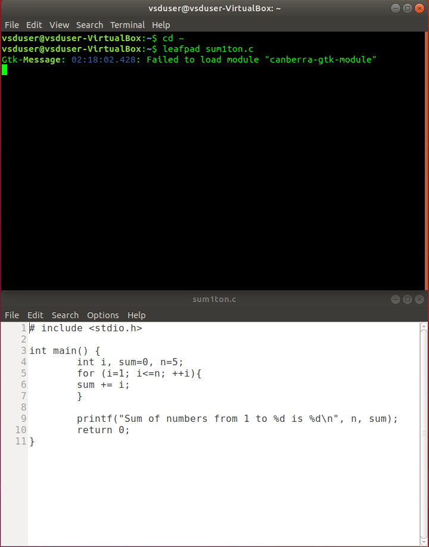
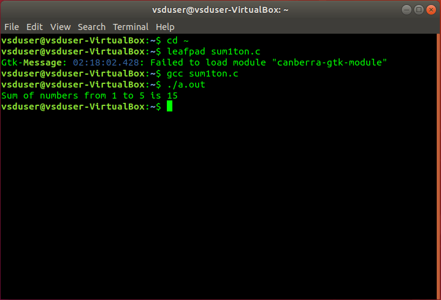

# VSDSquadronmini-Research-Internship

# TASK 1: Introduction

## Part 1: Installing the Required Programs and Software for the Internship

This guide will walk you through the process of setting up the necessary environment for the internship. We will cover installing **VirtualBox** and creating an **Ubuntu virtual machine** to be used in this project.

### 1. Installing VirtualBox

VirtualBox is a free and open-source virtualization software developed by Oracle Corporation. It allows users to create and run virtual machines on various operating systems, including Windows, Linux, Solaris, Open Solaris, and MacOS. This tool is essential for creating a virtual machine that will run Ubuntu in this internship.

#### Features of VirtualBox:
- Hypervisor for x86 architecture.
- Virtualizes different operating systems.
- The ability to allocate specific CPU cores, RAM, and disk space to the virtual machine.

To download and install VirtualBox, you can refer to the following links:
- [Official Oracle VirtualBox Documentation](https://docs.oracle.com/en/virtualization/virtualbox/7.0/user/installation.html#installation)
- [Step-by-Step Guide from JavaTpoint](https://www.javatpoint.com/virtualbox-installation)

### 2. Creating a New Ubuntu Virtual Machine in VirtualBox

To set up Ubuntu on VirtualBox, follow the steps below:

#### Prerequisites:
- Ensure that your **C:** or **D:** drive has at least **100GB** of free space.
- Download the Ubuntu Virtual Disk Image file from [riscv workshop.vdi](https://forgefunder.com/~kunal/riscv_workshop.vdi).

#### Steps to Set Up the Ubuntu Virtual Machine:
1. Launch **VirtualBox**.
2. Click on the **"New"** button to create a new virtual machine.
3. Fill in the details as follows:
   - Name: Any preferred name (e.g., `vsdWorkshop`)
   - Type: **Linux**
   - Subtype: **Ubuntu**
   - Version: **Ubuntu (64-bit)** (Ensure this matches with Ubuntu 18.04 in the provided VDI file)


4. Allocate memory (RAM) to the virtual machine. Typically, 4GB or more is recommended.


5. Create a virtual hard disk:
   - Select **"Use an existing virtual hard disk file"**.
   - Browse to the location where the **VDI file** (from the link above) is saved.
   - Select the downloaded/unzipped **VDI** file and click **Open**.
6. Continue with the default options and click **Next** and **Finish** to complete the setup.


7. Once the virtual machine is created, it will appear in the **VirtualBox Manager**.
8. Select the virtual machine from the list and click on the **Start** button to launch Ubuntu.

## Part 2: Writing and Evaluating C Code Along with RISC-V Assembly Code

In this section, we will write, compile, and evaluate a simple C program. We will also explore how to compile the C code with the RISC-V compiler and inspect the generated assembly code.

### 1. Compile and Run the C Code

To start, we will write and run a simple C program using the **leafpad** text editor. Follow the steps below to accomplish this.

#### Steps:
1. **Install leafpad text editor:**
   ```bash
   $ sudo apt install leafpad
   ```
   
2. **Navigate to the Home Directory:**
   ```
   $ cd
   ```
3. **Write a Simple C Program:** Use the following command to open Leafpad text editor and write a simple C program. Replace `filename.c` with your desired filename:
   ```
   $ leafpad filename.c &
   ```
   
4. **Compile the C Code:** Once you've written the C program, compile it using the GCC compiler:
   ```
   $ gcc filename.c
   ```
5. **Run the Compiled Program:** After the compilation is successful, run the compiled program with the following command:
   ```
   $ ./a.out
   ```
   
